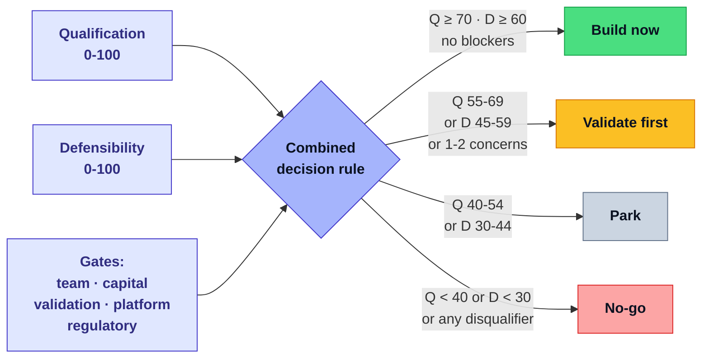
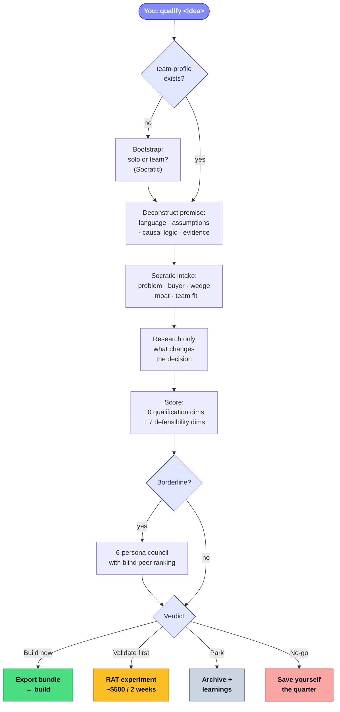
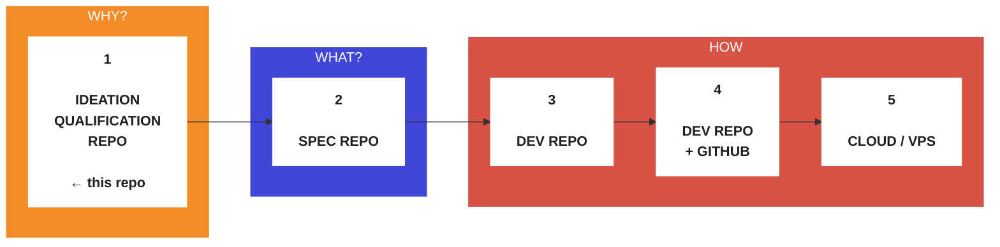

# Worth Building

[](LICENSE)
[](https://github.com/kommuniker/worth-building/actions/workflows/ci.yml)
[](AGENTS.md)
[](https://claude.com/claude-code)
[](AGENTS.md)
[](CONTRIBUTING.md)
[](https://github.com/kommuniker/worth-building/stargazers)
[](https://github.com/kommuniker/worth-building/commits/main)
[](https://github.com/kommuniker/worth-building/issues)

> In 2026, building software is trivial. Defending it is hard. This repo
> helps you decide *which idea is actually worth your next three months*.
> If you're about to commit three months to an idea, spend thirty minutes
> running `/qualify` first.

## TL;DR

You bring an idea. The tool runs a rigorous Socratic qualification with
your AI coding agent — the same pressure-test a YC partner or a
skeptical board member would apply — and produces one of four verdicts
with the reasoning:

- **Build now** — real wedge, defensible moat, team that can win
- **Validate first** — promising, but one assumption needs a cheap
  experiment first (the tool designs the experiment for you)
- **Park** — interesting, but the conditions aren't there
- **No-go** — structural flaw; save yourself the quarter

Every verdict ships with one concrete action you can take this week.

Compatible with **Claude Code**, **Cursor**, **Codex CLI**, **Gemini
CLI**, **Windsurf**, or any AI coding agent that reads `AGENTS.md`.

## What you actually get

For every qualified idea, a folder of Markdown files on your disk:

- **`decision.md`** — verdict and reasoning, one page
- **`idea.md`** — concept overview
- **`scoring.md`** — 10 qualification dimensions + 7 defensibility
  dimensions, each with specific reasoning
- **`recommendations.md`** — action plan with one concrete first
  action this week
- **`validation-plan.md`** — designed experiment with pass/fail (for
  Validate-first verdicts)
- **`risks.md`** — decision-critical risks with mitigations
- **`market.md`, `competition.md`, `economics.md`** — the research
  that informed the verdict
- **`sources.md`** — citations for every factual claim

Plus a **tool-agnostic export bundle** — run
`scripts/export-bundle <idea>` and get a portable folder that any AI
tool (Claude, ChatGPT, Cursor, Copilot, Windsurf, Gemini, Codex) can
consume, complete with a built-in `AI-PICKUP.md` that tells the
downstream agent *what to do* (execute the verdict) and *what not to
do* (re-qualify, re-score, invent new positioning).

## See a complete worked example

A fully worked (fictional) qualification for an AI scribe product lives
at
[`docs/assessments/example-ai-physio-scribe/`](docs/assessments/example-ai-physio-scribe/README.md).
Verdict: **Validate first**, with a designed landing-page experiment
and a `$500 / 2-week` test that pre-commits to pass/fail thresholds
before the data arrives.

Reading that example is the fastest way to decide if this tool is for
you.

> [!IMPORTANT]
> **Most ideas will not earn Build-now. That's the point.**
>
> The base rate of build-worthy ideas is genuinely low — maybe 1 in
> 10 of what a founder considers in a year. A tool that stamps
> Build-now on half your ideas is a yes-man, not a qualifier.
> Validate-first is also a yes — it means "go, but run this one cheap
> experiment first." Park and No-go save you months on the wrong
> direction.

## Why people use this

- You're scanning a vertical (healthcare, legal, construction, finance,
  etc.) and want to know where **AI-native** opportunities actually
  exist before committing.
- You're about to commit months to a build and want a second opinion
  that isn't your friends being polite.
- You have 3-5 ideas and want to decide which to build first.
- You're leaving a job with an idea and want a hard pressure-test before
  jumping.
- You need to hand a qualified idea to a collaborator, contractor, or
  another AI tool — and want them working from the same reasoning you
  did.

## How it's different from…

| Instead of… | You get… |
|---|---|
| **"Validate my idea" in ChatGPT** | A framework with named dimensions and pre-committed thresholds, not a nice-sounding agreement |
| **Pitch deck review from a friend** | Calibrated skepticism + forcing questions that find what you didn't let yourself see |
| **A 30-page market report** | A decision with explicit reasoning, a risk register, and one specific action for this week |
| **Building and hoping** | A designed experiment with pre-committed pass/fail criteria, run for under $500 |
| **A startup cofounder matching service** | An honest read on whether *your specific team* can actually win this idea, before you take on another person |

## Try it in 3 commands

```bash
git clone https://github.com/kommuniker/worth-building.git
cd worth-building
cp .worth-building/team-profile.example.yaml \
   .worth-building/team-profile.yaml
```

Edit `team-profile.yaml` with your team's skills, distribution
capabilities, and constraints — this is the lens through which every
idea will get scored. Then open the repo in Claude Code, Cursor,
Codex, or Gemini CLI and type:

```text
qualify <your idea>
```

The agent walks you through the rest.

## First run — what to expect

Three things new users typically wonder, answered up-front:

**Where does `team-profile.yaml` come from?** It is a local,
gitignored file describing *your team*. The repo ships
`.worth-building/team-profile.example.yaml` (pre-filled with sensible
solo-developer defaults). The first time you run `/qualify`, the
wizard either reads an existing `team-profile.yaml` or — if it
doesn't exist — bootstraps one for you by asking 4 short questions
and writing the file directly. **You do not edit YAML manually.**

**`/qualify` versus `scripts/assess` — which do I run?** Always
`/qualify`. It is the conversational entry point in your AI agent
(Claude Code, Cursor, Codex, Gemini). `scripts/assess` is a backend
bootstrap helper that the agent invokes internally; you do not need
to run it as a first step. (If you explicitly prefer terminal-first
bootstrapping, see `docs/runbooks/run-an-assessment.md` → "Terminal
Fallback".)

**What if I just type `/qualify` with no idea?** The wizard will
politely ask you for one. It is not an error.

If something goes sideways — `check-assessment` flags placeholders, a
prompt feels off, you want to abandon a run — see
[`docs/runbooks/troubleshooting.md`](docs/runbooks/troubleshooting.md).

## 30-second demo

```text
You:    qualify ai scribe for physical therapy clinics

Agent:  The "AI scribe" category is crowded in doctor's offices. What
        makes physical therapy clinics specifically the narrow wedge
        here? Name one clinic that would pay this week.

You:    [answer]

Agent:  [Runs a Socratic intake — one question at a time — writing
        files as it goes. Applies fatal-flaw hunting. Scores 10
        qualification + 7 defensibility dimensions. Checks team fit.
        Optionally invokes a 6-persona council for borderline calls.]

Agent:  Verdict: Validate first (qualification 62/100, defensibility
        54/100). Core risk: you're assuming PT owners have the same
        note-taking pain as GPs, but their session notes are briefer
        and regulated differently. Designed a $500 / 2-week landing
        page test (see validation-plan.md). First action this week:
        email these three clinic owners with the problem framing by
        Friday.
```

## The scoring, in one glance

**10 Qualification dimensions** (is this worth pursuing *now*?) — max 100:

- Problem Severity & Urgency · Buyer Clarity, Budget, Switching
  Willingness · Beachhead & Distribution Realism · Competitive Advantage
  & Moat Path · Workflow Embedding & Retention · Revenue Quality &
  Capital Efficiency · Founder/Team Right To Win · Timing & Market
  Pull · Validation Speed & Cost · Dependency/Regulatory/Operational
  Complexity

**7 Defensibility dimensions** (what becomes hard to copy after launch?) —
max 100:

- Proprietary Data & Context Moats · Workflow Embedding & Switching
  Costs · Trust, Compliance & Governance · Vertical Integration &
  Niche Depth · Network Effects & Community · Speed of Iteration &
  Learning Velocity · Hardware Integration

**Build-now bar**: qualification ≥ 70, defensibility ≥ 60, no
blockers in team fit / capital / validation cost / platform
dependency / regulatory readiness.



For borderline verdicts (qualification 65-75, defensibility 55-65),
the tool can run a **6-persona council** — Operator, Financier,
Skeptic, Visionary, Customer Advocate, Strategist — who each evaluate
independently, then peer-rank each other's assessments blind. A
chairman synthesizes. Blind peer-ranking removes persona-based
anchoring and surfaces perspectives that the surface-level consensus
hid.

## How it works, visually



## Where this fits in a spec-driven AI workflow

Worth Building is **stage 1 of a five-stage AI-assisted
development pipeline**, mapping onto **Why → What → How**:

- **Why** (Stage 1): is this idea worth building? ← this repo
- **What** (Stage 2): what exactly are we building?
- **How** (Stages 3–5): building, shipping, running it.

Conflating *why should we?* with *what should we build?* and *how
should we build it?* produces bad answers to all three.



## The philosophy that shapes the output

> [!IMPORTANT]
> Pure AI-enthusiast hype gets zero points here. The tool will hunt
> for the fatal flaw in your idea before it will celebrate it.

The tool **defaults to skepticism** — it assumes every idea contains a
fatal flaw until evidence proves otherwise, and actively hunts for weak
demand, hidden competitors, distribution failure, or missing
right-to-win. If an idea survives rigorous scrutiny, the stance flips to
explicit earned praise and execution enablement.

It **scores team fit as a first-class dimension**. Distribution
realism, right-to-win, validation speed, and capital fit are all scored
for *your specific team*, not a generic startup. The same idea can score
differently for different teams.

It **forces specificity**. "The market is large" is not evidence. "This
clinic spends $8K/month on outsourced transcription and is actively
shopping" is evidence. Forcing questions expose the gap between
comfortable abstraction and real buying behavior: *name one specific
person who would pay for this this week*.

It **stops at the decision**. No opinions about your stack,
architecture, or feature roadmap. Those decisions belong to you and
your build-time AI.

It **works across AI tools**. Export bundles work with any downstream
AI regardless of what the implementer's team uses.

## What it is not

- **Not an idea generator.** Bring an idea. For inspiration, run
  `scan <vertical>` to map where AI-native opportunities exist.
- **Not a pitch-deck generator.** Outputs are internal decision memos.
- **Not a crystal ball.** It surfaces reasoning and calibrated
  scoring; it doesn't guarantee outcomes.
- **Not a product-building tool.** The verdict hands off to whatever
  implementation tool you use.

## Who this is for

- **Solo founders and small (1-5 person) teams** deciding which idea
  to commit to.
- **Indie builders** scanning for a vertical AI wedge where their
  technical skills are an unfair advantage.
- **Product people** inside companies evaluating new bets.
- **Anyone** who's been burned by building something nobody paid for
  and wants a cheaper way to test the next idea.

## Installation details

**Prerequisites:** Bash and Git. Tested on macOS and Linux. No language
runtime, package manager, or service account is required for the core
workflow scripts.

**Works with any AI agent that reads `AGENTS.md`:** Claude Code,
Cursor, Codex CLI, Gemini CLI, Windsurf, Aider, Cline. Tool-specific
adapter files exist for Claude and Gemini but are thin wrappers over
the shared rules.

**Your team profile stays private.** The repo gitignores
`team-profile.yaml` and all individual assessments by default.
Qualification output is local unless you choose to share it.

## Honest status

- **Frameworks and scoring rubrics**: stable. The 7 defensibility
  dimensions and 10 qualification dimensions have been refined through
  real use.
- **Socratic wizard**: works well in Claude Code and tested in Cursor.
  Gemini CLI and Codex integrations exist but see less use.
- **Council deliberation**: recently added; the blind peer-ranking
  protocol is working but edge cases are still being shaken out.
- **Export bundle**: production-ready. Tool-agnostic by design — tested
  by handing bundles to agents in multiple tools.
- **Scripts**: all critical scripts use portable bash and stock Unix
  tools.
- **Not yet**: a hosted web version, a GUI, or a published Claude-skill
  distribution. You run it from your terminal.

## Project Structure

```
worth-building/
  AGENTS.md                      # Shared rules (all agents read this)
  CLAUDE.md                      # Claude thin wrapper
  GEMINI.md                      # Gemini thin wrapper
  LICENSE                        # MIT
  NOTICE.md                      # Third-party inspiration notice
  project.manifest.yaml          # Project configuration
  .github/                       # CI, issue templates, PR template
  .claude/                       # Claude agents, settings, commands
  .gemini/                       # Gemini settings
  .codex/                        # Codex settings
  .worth-building/ # Machine-readable project context
    team-profile.example.yaml    # Example team profile (fill in yours)
  core/
    prompts/
      roles/                     # Role prompts (competitive-analyst, etc.)
      workflows/                 # Workflow prompts (qualify-idea, council…)
      analysis/                  # Scoring frameworks (qualification, defensibility)
    templates/
      assessments/               # Output templates (one-pager, RAT, etc.)
      research/                  # Research templates (competitors, pretotype-menu)
      export-bundle/             # Generic export templates (README, AI-PICKUP)
      portfolio/                 # Multi-idea comparison templates
  scripts/                       # Callable workflow scripts
  docs/
    assessments/                 # Qualification output (gitignored by default)
    research/                    # Research output (gitignored by default)
    glossary/                    # Business + product terminology (English)
    runbooks/                    # Operational procedures
    meta/                        # Project metadata
```

## Inspirations / Related Work

The recent framework and rigor work was mined from four other Claude
Code projects that cover adjacent ground. If this tool is useful to
you, those are worth a look too:

- [**Claude-Business-Evaluator**](https://github.com/danielrosehill/Claude-Business-Evaluator)
  by Daniel Rosehill. The ICEC scoring framework and the 6-persona
  LLM Council with blind peer ranking — we adopted the council
  protocol as our debiased second-opinion workflow.
- [**project-idea-validator**](https://github.com/VoltAgent/awesome-claude-code-subagents/blob/main/categories/10-research-analysis/project-idea-validator.md)
  by VoltAgent. Explicit anti-sycophancy stance — "assume every idea
  contains a fatal flaw until evidence proves otherwise" — which we
  adopted as the default operating mode.
- [**startup-skills**](https://github.com/bwerneckm/startup-skills)
  by Breno Werneck. The Riskiest Assumption Test format, B2B/B2C
  interview variants, and the hard-gate pattern before scoring.
- [**show-me-the-money**](https://github.com/iamzifei/show-me-the-money)
  by iamzifei. The Problem Deconstruction Funnel (language precision
  → assumption audit → causal logic → evidence sufficiency) and the
  Six Forcing Questions (name one person who'd pay this week, the
  observation test, future-fit).

## Contributing

See [`CONTRIBUTING.md`](CONTRIBUTING.md). New forcing questions,
sharper role prompts, pretotype methods, language translations, and
bad-verdict reports are all welcome.

## About

Built and maintained by **[Kristian Stoffregen](https://kristian-stoffregen.dk/)**
— Ph.D and, senior consultant and IT architect working on digital
transformation, business and IT architecture, and digital-first
organizational strategy. The opinionated stance of this tool comes from
watching organizations commit to software investments that a rigorous
qualification conversation would have parked, validated, or killed
before the first line of code.

Found a sharper framework? Got a verdict that aged badly? Open a
GitHub issue, reach the author via the
[personal site](https://kristian-stoffregen.dk/), or connect on
[LinkedIn](https://www.linkedin.com/in/kristian-stoffregen/).

## Releases

Version history and release notes live in
[`CHANGELOG.md`](CHANGELOG.md). The current version is in
[`VERSION`](VERSION). Maintainers cut releases with
`scripts/release` (see `docs/runbooks/troubleshooting.md` for the
flow).

## Disclaimer

Worth Building produces **informational analysis, not professional,
financial, legal, or investment advice**. Verdicts (`Build now`,
`Validate first`, `Park`, `No-go`), scores, risk registers, and
recommendations reflect a framework's opinion based on the inputs you
provide — they are not predictions or guarantees of outcomes.

You are solely responsible for any business, financial, or strategic
decisions you make. Use at your own risk. Where a decision could
materially affect your livelihood, contracts, regulated activity, or
third parties, consult a qualified human professional.

The software is provided "as is", without warranty of any kind, under
the MIT license — see [`LICENSE`](LICENSE).

## License

MIT — use freely, modify for your team, contribute improvements back.
See [`NOTICE.md`](NOTICE.md) for related-work attribution notes.
